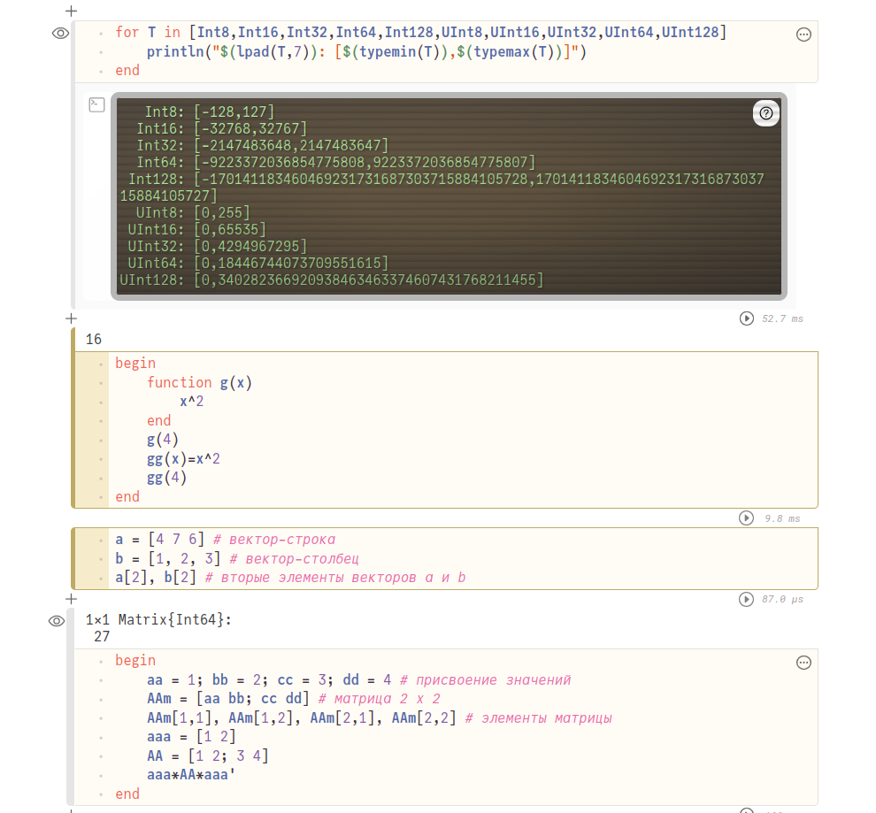
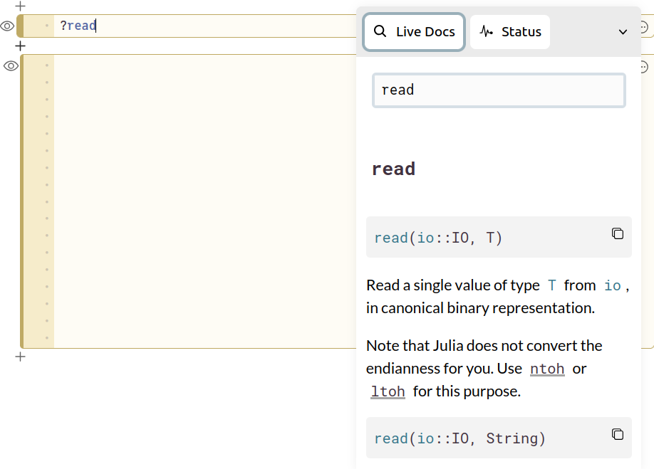
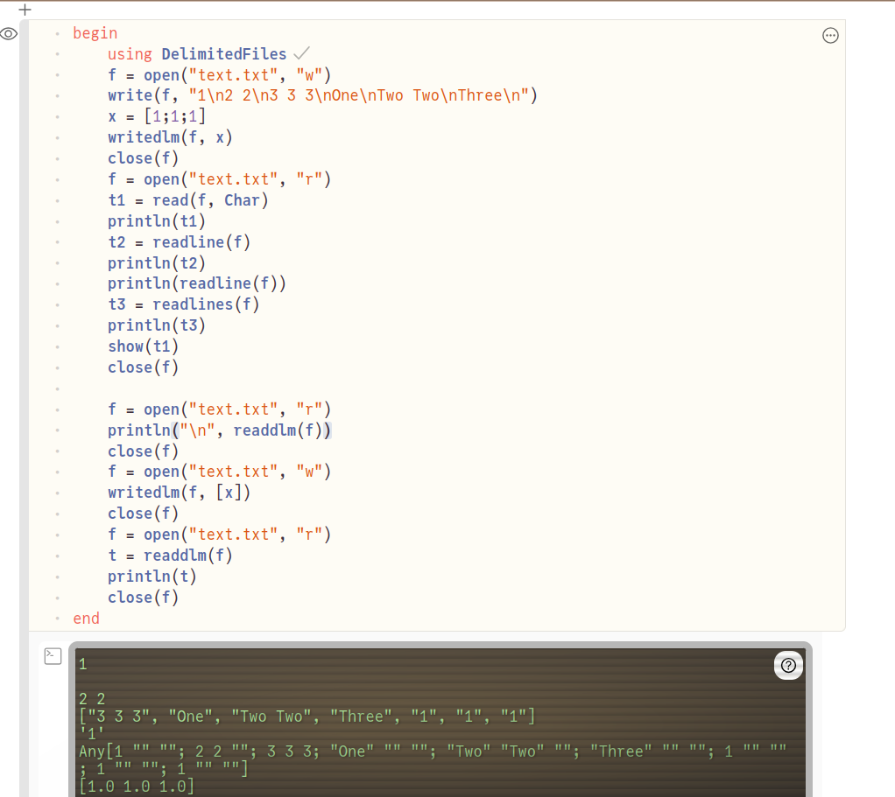
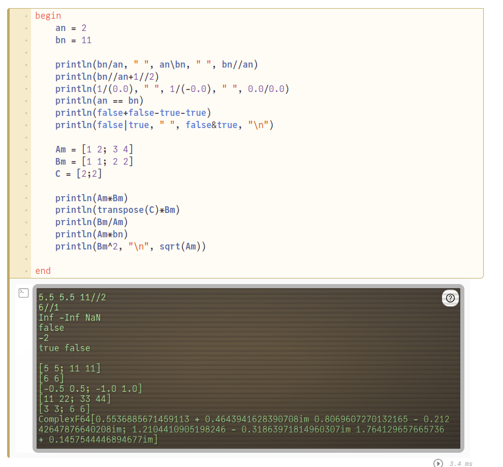

---
## Front matter
lang: ru-RU
title: Лабораторная работа № 1. Julia. Установка и настройка. Основные принципы
subtitle: Компьютерный практикум по статистическому анализу данных
author:
  - Демидова Е. А.
institute:
  - Российский университет дружбы народов, Москва, Россия
date: 10 ноября 2024

## i18n babel
babel-lang: russian
babel-otherlangs: english

## Formatting pdf
toc: false
toc-title: Содержание
slide_level: 2
aspectratio: 169
section-titles: true
theme: metropolis
header-includes:
 - \metroset{progressbar=frametitle,sectionpage=progressbar,numbering=fraction}
 - '\makeatletter'
 - '\beamer@ignorenonframefalse'
 - '\makeatother'
---

# Информация

## Докладчик

:::::::::::::: {.columns align=center}
::: {.column width="70%"}

  * Демидова Екатерина Алексеевна
  * студентка группы НКНбд-01-21
  * Российский университет дружбы народов
  * <https://github.com/eademidova>

:::
::: {.column width="30%"}

:::
::::::::::::::

# Введение

**Цель работы**

Основная цель работы -- подготовить рабочее пространство и инструментарий для работы с языком программирования Julia, на простейших примерах познакомиться с основами синтаксиса Julia.

**Задачи**

1. Установите под свою операционную систему Julia, Jupyter.
2. Используя Jupyter Lab, повторите примеры из раздела 1.3.3.
3. Выполните задания для самостоятельной работы:
   1. Изучите документацию по основным функциям Julia для чтения / записи / выво- да информации на экран: read(), readline(), readlines(), readdlm(), print(), println(), show(), write(). Приведите свои примеры их использования, поясняя особенности их применения.
   2. Изучите документацию по функции parse(). Приведите свои примеры её использования, поясняя особенности её применения.
   3. Изучите синтаксис Julia для базовых математических операций с разным типом переменных: сложение, вычитание, умножение, деление, возведение в степень, извлечение корня, сравнение, логические операции. Приведите свои примеры с пояснениями по особенностям их применения.
   4. Приведите несколько своих примеров с пояснениями с операциями над матрицами и векторами: сложение, вычитание, скалярное произведение, транспонирование, умножение на скаляр.

# Выполнение лабораторной работы

## Примеры

{#fig:001 width=50%}

## Самостоятельная работа

{#fig:002 width=50%}

## Самостоятельная работа

{#fig:003 width=50%}

## Самостоятельная работа

{#fig:004 width=50%}

# Выводы

В результате выполнения работы подготовили рабочее пространство и инструментарий для работы с языком программирования Julia, на простейших примерах познакомились с основами синтаксиса Julia.

## Список литературы

1. JuliaLang [Электронный ресурс]. 2024 JuliaLang.org contributors. URL: https: //julialang.org/ (дата обращения: 11.10.2024).
2. Julia 1.11 Documentation [Электронный ресурс]. 2024 JuliaLang.org contributors. URL: https://docs.julialang.org/en/v1/ (дата обращения: 11.10.2024).