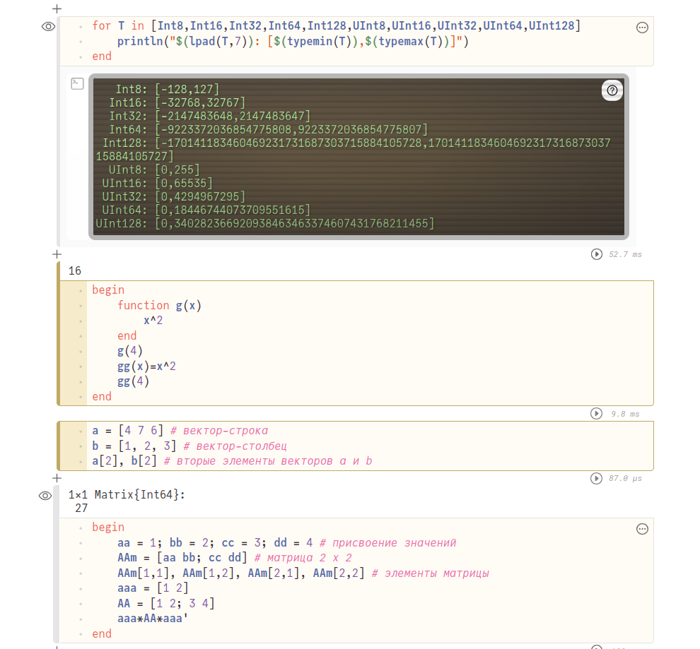
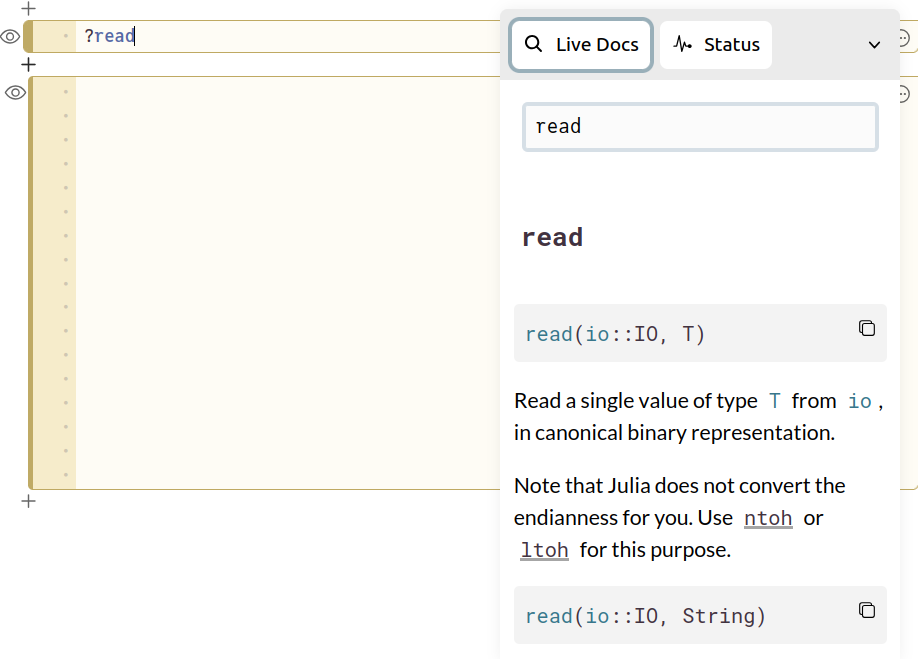
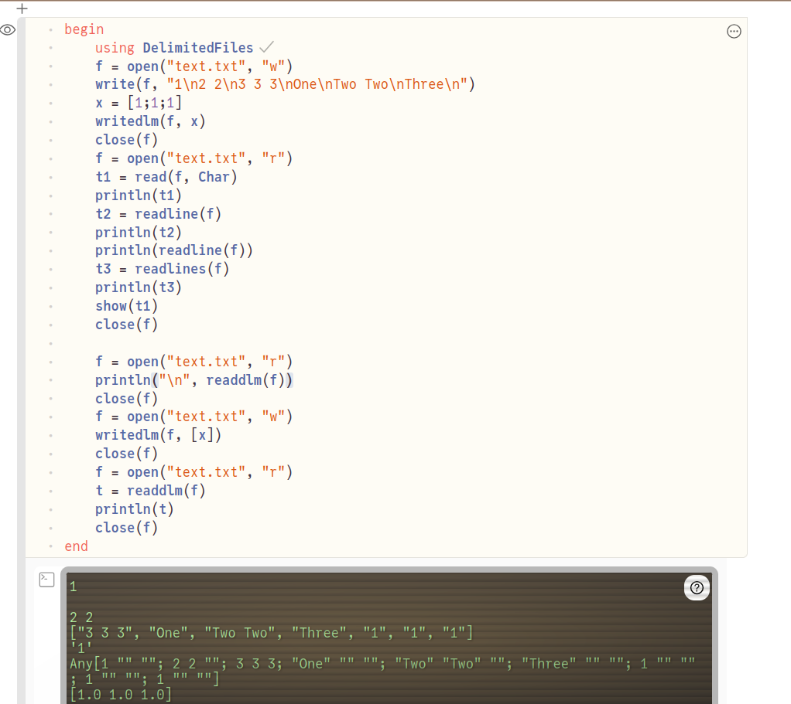
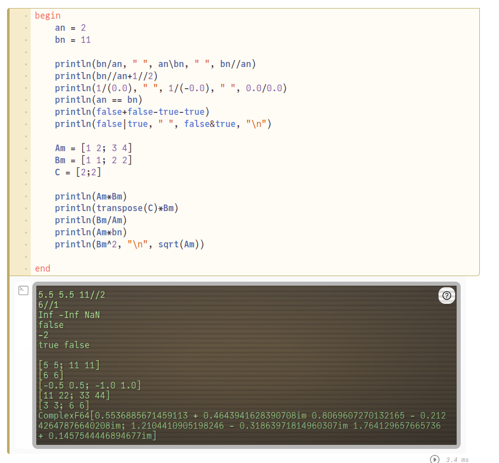

---
## Front matter
title: "Компьютерный практикум по статистическому анализу данных"
subtitle: "Лабораторная работа № 1. Julia. Установка и настройка. Основные принципы"
author: "Демидова Екатерина Алексеевна"

## Generic otions
lang: ru-RU
toc-title: "Содержание"

## Bibliography
bibliography: bib/cite.bib
csl: pandoc/csl/gost-r-7-0-5-2008-numeric.csl

## Pdf output format
toc: true # Table of contents
toc-depth: 2
lof: true # List of figures
lot: false # List of tables
fontsize: 12pt
linestretch: 1.5
papersize: a4
documentclass: scrreprt
## I18n polyglossia
polyglossia-lang:
  name: russian
  options:
	- spelling=modern
	- babelshorthands=true
polyglossia-otherlangs:
  name: english
## I18n babel
babel-lang: russian
babel-otherlangs: english
## Fonts
mainfont: PT Serif
romanfont: PT Serif
sansfont: PT Sans
monofont: PT Mono
mainfontoptions: Ligatures=TeX
romanfontoptions: Ligatures=TeX
sansfontoptions: Ligatures=TeX,Scale=MatchLowercase
monofontoptions: Scale=MatchLowercase,Scale=0.9
## Biblatex
biblatex: true
biblio-style: "gost-numeric"
biblatexoptions:
  - parentracker=true
  - backend=biber
  - hyperref=auto
  - language=auto
  - autolang=other*
  - citestyle=gost-numeric
## Pandoc-crossref LaTeX customization
figureTitle: "Рис."
tableTitle: "Таблица"
listingTitle: "Листинг"
lofTitle: "Список иллюстраций"
lotTitle: "Список таблиц"
lolTitle: "Листинги"
## Misc options
indent: true
header-includes:
  - \usepackage{indentfirst}
  - \usepackage{float} # keep figures where there are in the text
  - \floatplacement{figure}{H} # keep figures where there are in the text
---

# Введение

**Цель работы**

Основная цель работы -- подготовить рабочее пространство и инструментарий для работы с языком программирования Julia, на простейших примерах познакомиться с основами синтаксиса Julia.

**Задачи**

1. Установите под свою операционную систему Julia, Jupyter.
2. Используя Jupyter Lab, повторите примеры из раздела 1.3.3.
3. Выполните задания для самостоятельной работы:
   1. Изучите документацию по основным функциям Julia для чтения / записи / вывода информации на экран: read(), readline(), readlines(), readdlm(), print(), println(), show(), write(). Приведите свои примеры их использования, поясняя особенности их применения.
   2. Изучите документацию по функции parse(). Приведите свои примеры её использования, поясняя особенности её применения.
   3. Изучите синтаксис Julia для базовых математических операций с разным типом переменных: сложение, вычитание, умножение, деление, возведение в степень, извлечение корня, сравнение, логические операции. Приведите свои примеры с пояснениями по особенностям их применения.
   4. Приведите несколько своих примеров с пояснениями с операциями над матрицами и векторами: сложение, вычитание, скалярное произведение, транспонирование, умножение на скаляр.

# Теоретическое введение

Julia — высокоуровневый свободный язык программирования с динамической типизацией, созданный для математических вычислений.[@julialang]. Эффективен также и для написания программ общего назначения. Синтаксис языка схож с синтаксисом других математических языков, однако имеет некоторые существенные отличия.

Для выполнения заданий была использована официальная документация Julia[@juliadoc].

# Выполнение лабораторной работы

Выполним примеры из лабораторной работы(рис. @fig:001)

{#fig:001 width=70%}

Для изучения документации достаточно поставить ? перед именем нужной функции(рис. @fig:002).

{#fig:002 width=70%}

При использовании основных функций Julia для чтения / записи / вывода информации(рис. @fig:003) можно увидеть следующие особенности:

- read() -- чтение одного элемента, 
- readline() -- чтение строки, 
- readlines() -- чтение всех строк файла и запись их в массив, 
- readdlm() -- считывает данные как матрицу с обязательно одинаковым количеством элементов в каждой строке(дописывает `""`, если элемента нет), 
- print() -- стандартный вывод без перевода строки, 
- println() -- стандартный вывод с переводом строки, 
- show() -- показывает внутренне представление данных(например, строковой тип с кавычками), 
- write() -- стандартная запись в файл.

{#fig:003 width=70%}

Применим базовые математические операции к числам, а затем к матрицам(рис. @fig:004). Можно заменить следующие особенности: существует такой тип данных как дробное число(при действии над дробями результат автоматически упрощается), при делении на ноль или минус ноль получаем тип данных бесконечность(то есть деление на ноль не запрещено), можно производить сложение и вычитание с булевыми значениями, как с числами 0 и 1. Работа с матрицами встроена в стандартную библиотеку, к ним применим знак умножения и деления, а также возведение в степень и извлечение корня(при извлечении корня из отрицательных чисел результат переводится в комплексную область).

{#fig:004 width=70%}

# Выводы

В результате выполнения работы подготовили рабочее пространство и инструментарий для работы с языком программирования Julia, на простейших примерах познакомились с основами синтаксиса Julia.

# Список литературы{.unnumbered}

::: {#refs}
:::

