---
## Front matter
title: "Компьютерный практикум по статистическому анализу данных"
subtitle: "Лабораторная работа № 2. Julia. Структуры данных"
author: "Демидова Екатерина Алексеевна"

## Generic otions
lang: ru-RU
toc-title: "Содержание"

## Bibliography
bibliography: bib/cite.bib
csl: pandoc/csl/gost-r-7-0-5-2008-numeric.csl

## Pdf output format
toc: true # Table of contents
toc-depth: 2
lof: true # List of figures
lot: false # List of tables
fontsize: 12pt
linestretch: 1.5
papersize: a4
documentclass: scrreprt
## I18n polyglossia
polyglossia-lang:
  name: russian
  options:
	- spelling=modern
	- babelshorthands=true
polyglossia-otherlangs:
  name: english
## I18n babel
babel-lang: russian
babel-otherlangs: english
## Fonts
mainfont: PT Serif
romanfont: PT Serif
sansfont: PT Sans
monofont: PT Mono
mainfontoptions: Ligatures=TeX
romanfontoptions: Ligatures=TeX
sansfontoptions: Ligatures=TeX,Scale=MatchLowercase
monofontoptions: Scale=MatchLowercase,Scale=0.9
## Biblatex
biblatex: true
biblio-style: "gost-numeric"
biblatexoptions:
  - parentracker=true
  - backend=biber
  - hyperref=auto
  - language=auto
  - autolang=other*
  - citestyle=gost-numeric
## Pandoc-crossref LaTeX customization
figureTitle: "Рис."
tableTitle: "Таблица"
listingTitle: "Листинг"
lofTitle: "Список иллюстраций"
lotTitle: "Список таблиц"
lolTitle: "Листинги"
## Misc options
indent: true
header-includes:
  - \usepackage{indentfirst}
  - \usepackage{float} # keep figures where there are in the text
  - \floatplacement{figure}{H} # keep figures where there are in the text
---

# Введение

**Цель работы**

Основная цель работы -- изучить несколько структур данных, реализованных в Julia, научиться применять их и операции над ними для решения задач.

**Задачи**

1. Используя Jupyter Lab, повторите примеры из раздела 2.2.
2. Выполните задания для самостоятельной работы (раздел 2.4).

# Теоретическое введение

Julia — высокоуровневый свободный язык программирования с динамической типизацией, созданный для математических вычислений.[@julialang]. Эффективен также и для написания программ общего назначения. Синтаксис языка схож с синтаксисом других математических языков, однако имеет некоторые существенные отличия.

Для выполнения заданий была использована официальная документация Julia[@juliadoc].

# Выполнение лабораторной работы

Выполним примеры из лабораторной работы для действий над кортежами(рис. @fig:001)

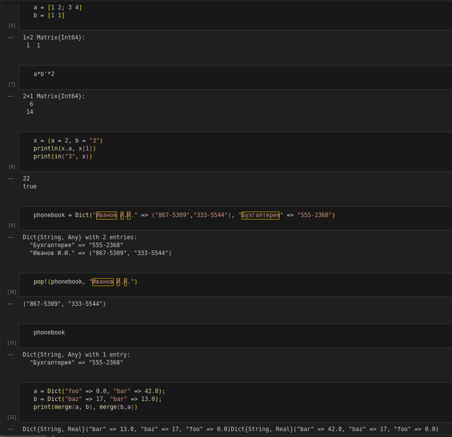{#fig:001 width=70%}

Также с множествами(рис. @fig:002)

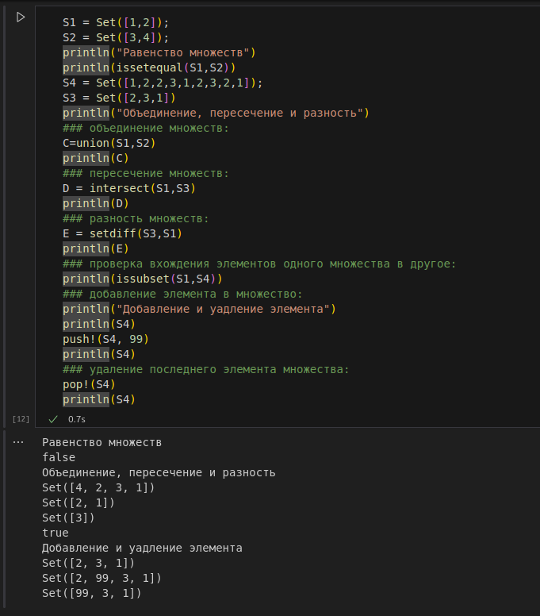{#fig:002 width=70%}

И с массивами(рис. @fig:003, @fig:004, @fig:005)

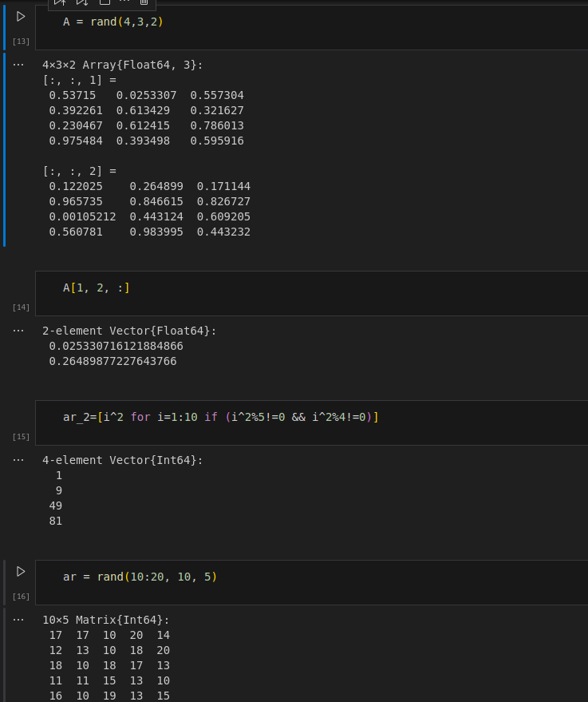{#fig:003 width=70%}

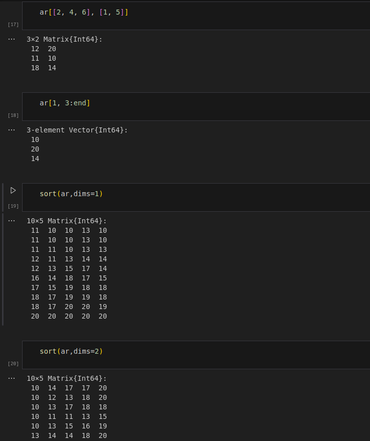{#fig:004 width=70%}

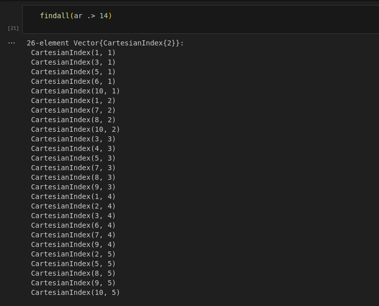{#fig:005 width=70%}

Выполним задания для самостоятельной работы. СНачала найдем необходимое множество и рассмотрим разные действия над множествами(рис. @fig:006)

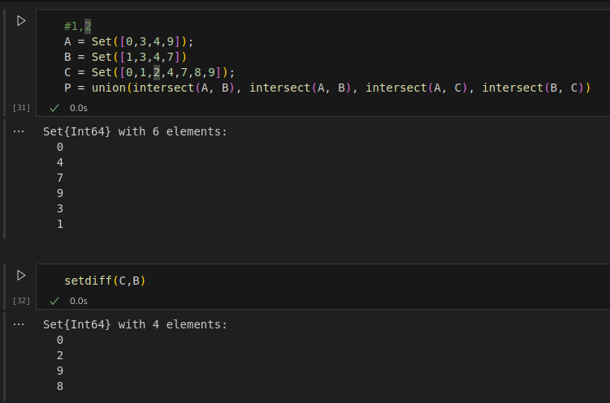{#fig:006 width=70%}

В третьем задании создадим нужные массивы, используя генераторы и циклы(рис. @fig:007 - @fig:011)

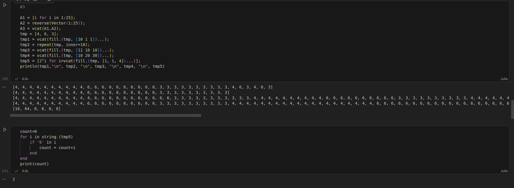{#fig:007 width=70%}

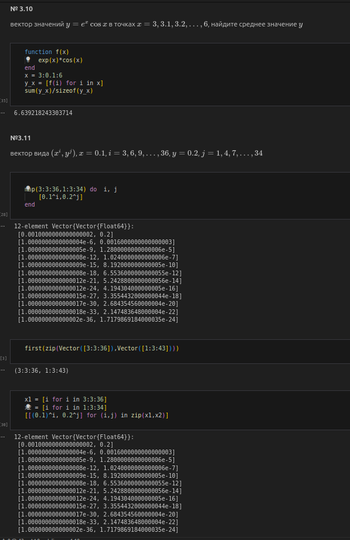{#fig:008 width=70%}

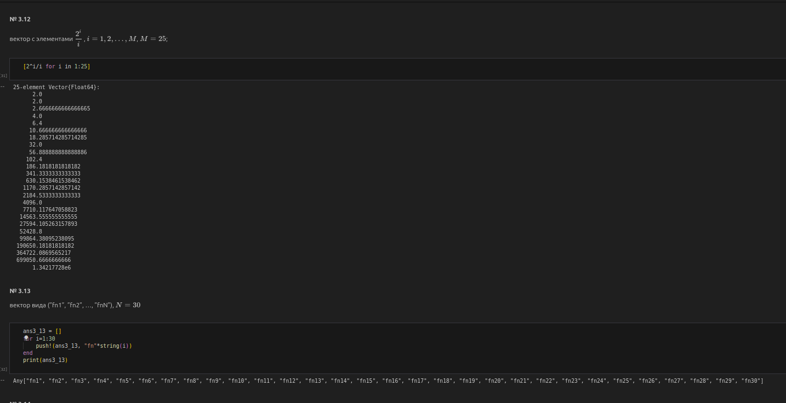{#fig:009 width=70%}

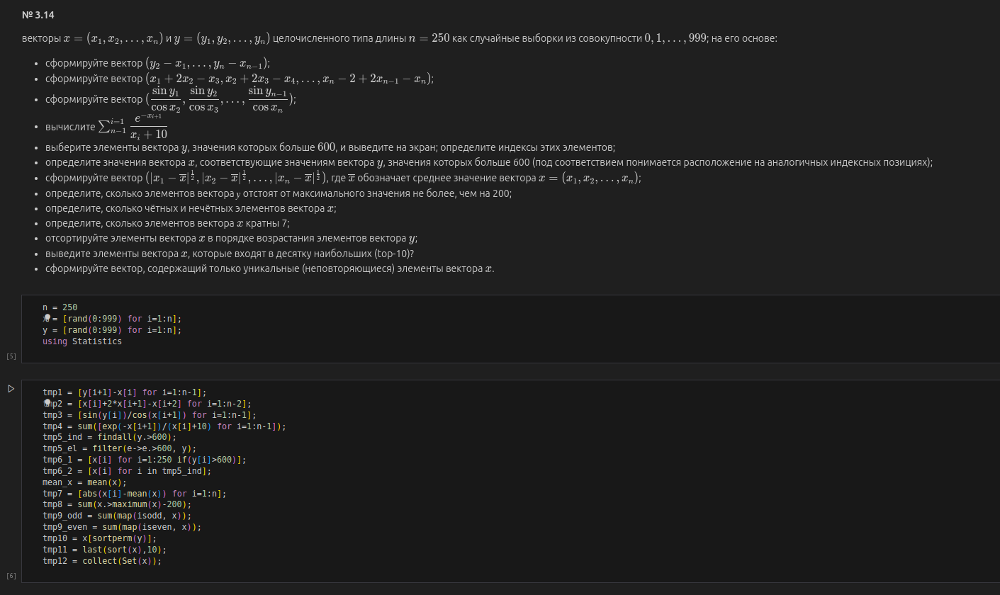{#fig:010 width=70%}

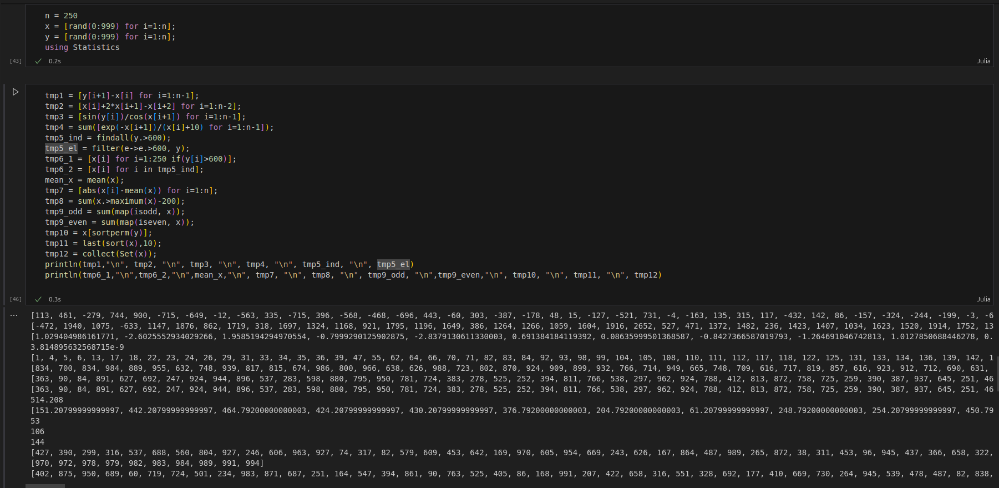{#fig:011 width=70%}

В 4 задании создадим массив квадратов чисел от 0 до 100(рис. @fig:012)

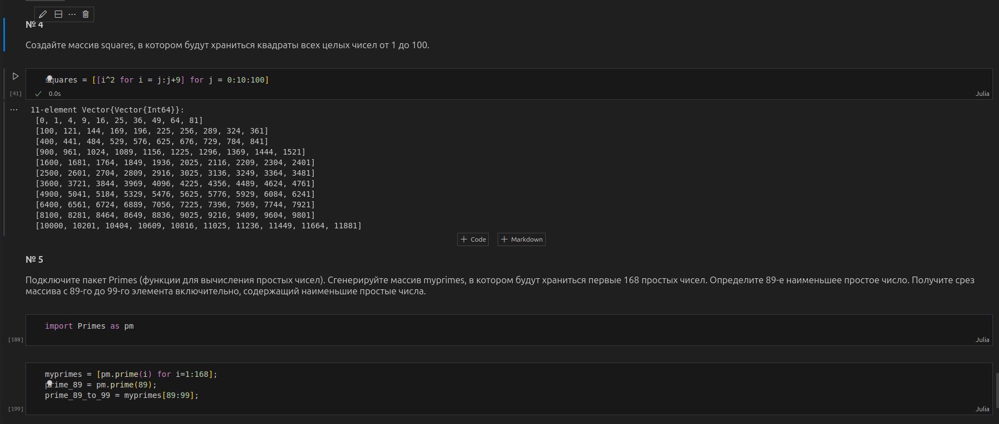{#fig:012 width=70%}

В 5 рассмотрим возможности пакета простых чисел, а в 6 вычислим сложные математические функции с помощью генераторов массивов и и функции суммирования(рис. @fig:013)

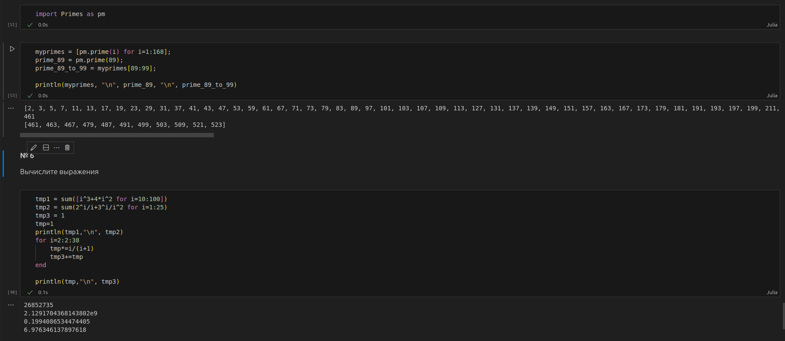{#fig:013 width=70%}

# Выводы

В результате выполнения работы изучили несколько структур данных, реализованных в Julia, научились применять их и операции над ними для решения задач.

# Список литературы{.unnumbered}

::: {#refs}
:::

