---
## Front matter
lang: ru-RU
title: Лабораторная работа № 7. Введение в работу с данными
subtitle: Компьютерный практикум по статистическому анализу данных
author:
  - Демидова Е. А.
institute:
  - Российский университет дружбы народов, Москва, Россия
date: 24 ноября 2024

## i18n babel
babel-lang: russian
babel-otherlangs: english

## Formatting pdf
toc: false
toc-title: Содержание
slide_level: 2
aspectratio: 169
section-titles: true
theme: metropolis
header-includes:
 - \metroset{progressbar=frametitle,sectionpage=progressbar,numbering=fraction}
 - '\makeatletter'
 - '\beamer@ignorenonframefalse'
 - '\makeatother'
---

# Информация

## Докладчик

:::::::::::::: {.columns align=center}
::: {.column width="55%"}

  * Демидова Екатерина Алексеевна
  * студентка группы НКНбд-01-21
  * Российский университет дружбы народов
  * <https://github.com/eademidova>

:::
::: {.column width="30%"}

:::
::::::::::::::

# Введение

**Цель работы**

Основной целью работы является специализированных пакетов Julia для обработки данных.

**Задачи**

1. Используя Jupyter Lab, повторите примеры.
2. Выполните задания для самостоятельной работы.

# Выполнение лабораторной работы

## Выполнение примеров

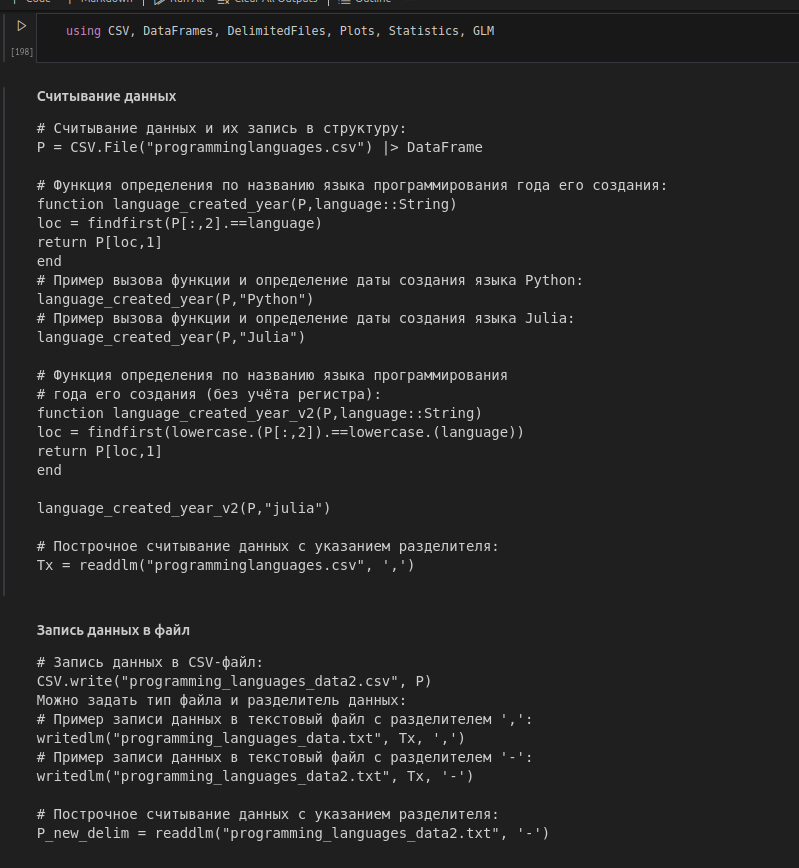{#fig:001 width=40%}

## Выполнение примеров

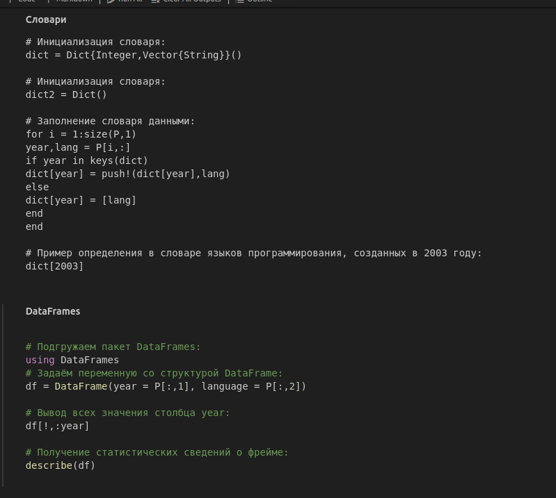{#fig:002 width=50%}

## Выполнение примеров

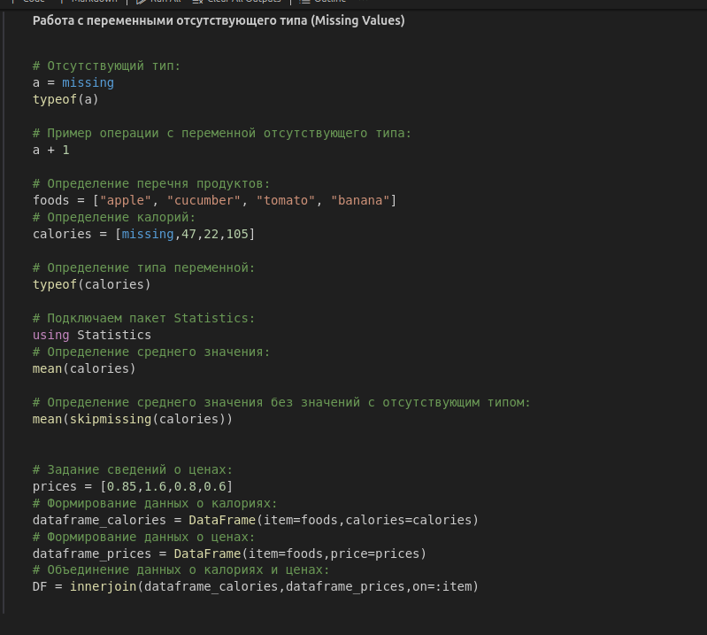{#fig:003 width=50%}

## Выполнение примеров

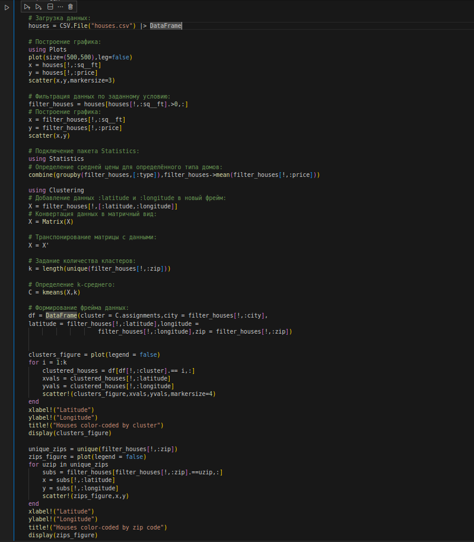{#fig:004 width=40%}

## Выполнение примеров

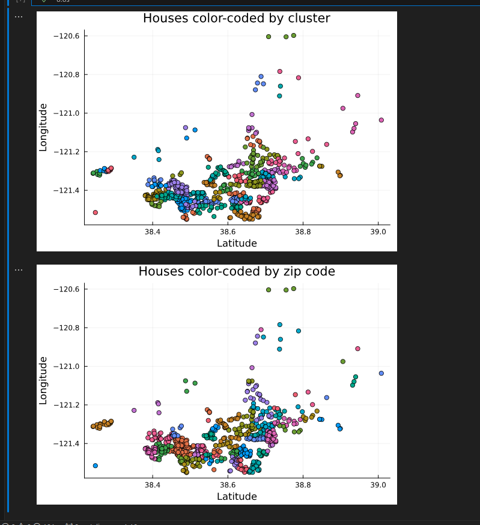{#fig:005 width=40%}

## Выполнение примеров

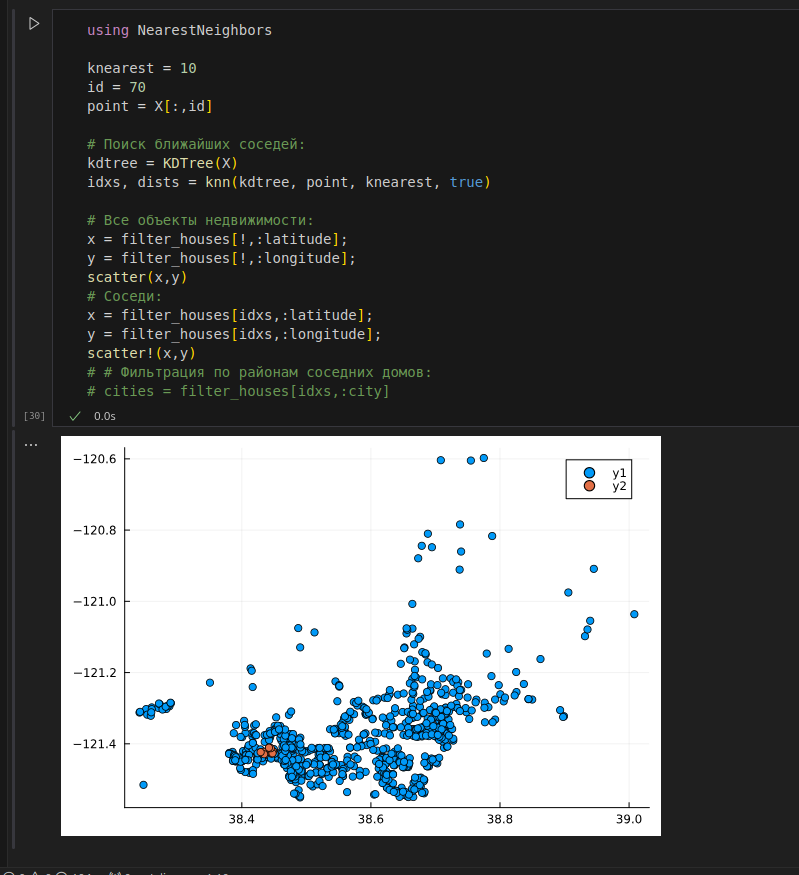{#fig:006 width=40%}

## Выполнение примеров

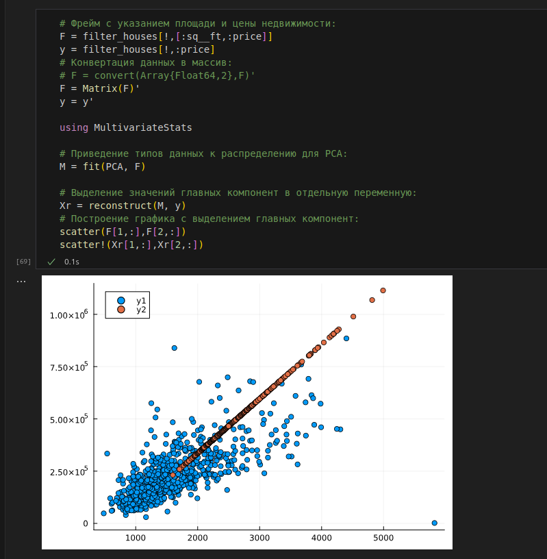{#fig:007 width=40%}

## Выполнение примеров

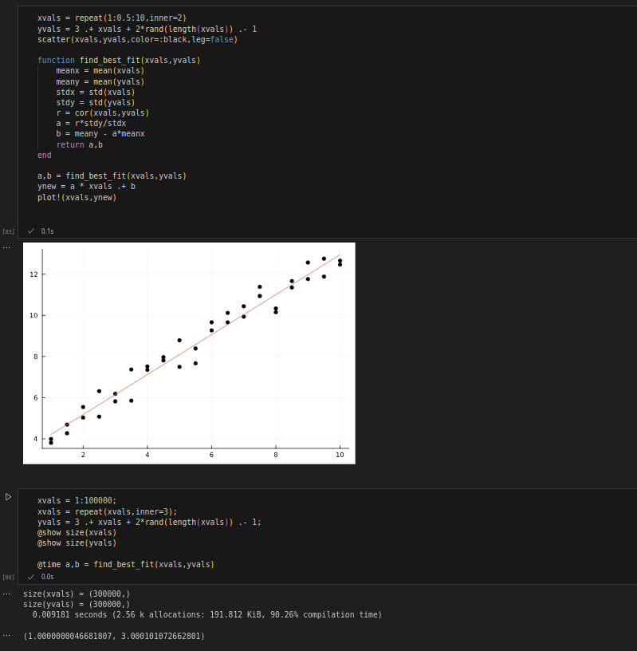{#fig:008 width=40%}

## Выполнение заданий для самостоятельной работы

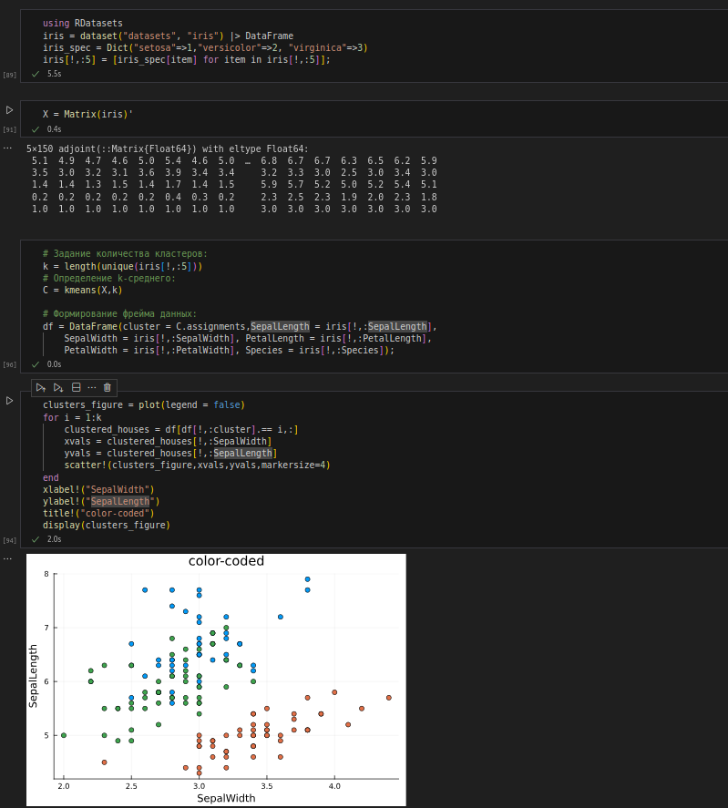{#fig:009 width=40%}

## Выполнение заданий для самостоятельной работы

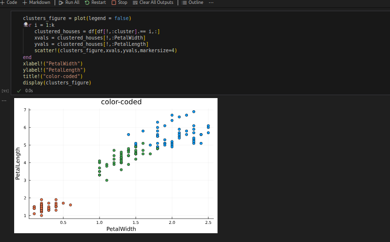{#fig:010 width=50%}

## Выполнение заданий для самостоятельной работы

{#fig:011 width=40%}

## Выполнение заданий для самостоятельной работы

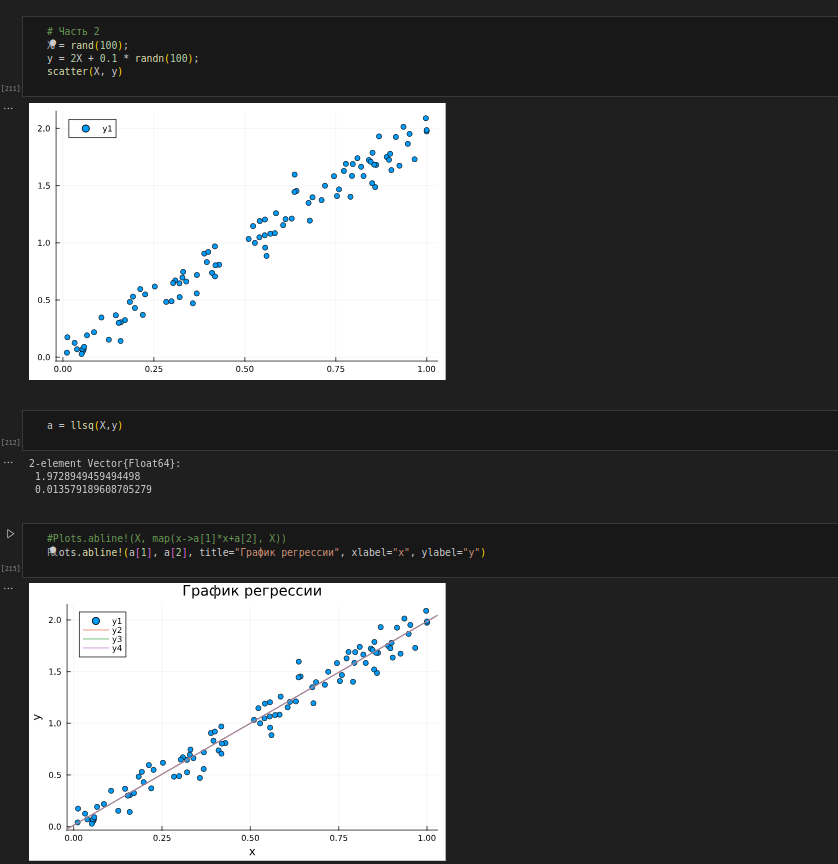{#fig:012 width=40%}

## Выполнение заданий для самостоятельной работы

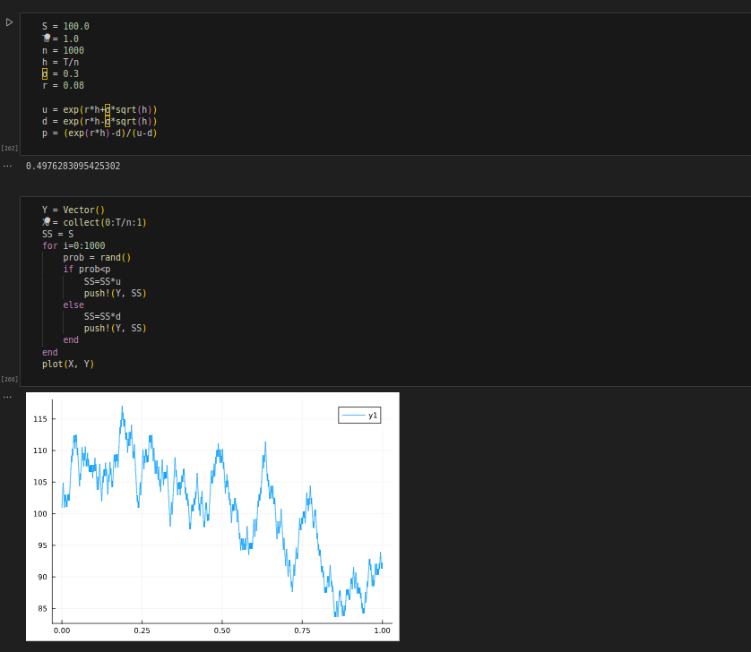{#fig:013 width=50%}

## Выполнение заданий для самостоятельной работы

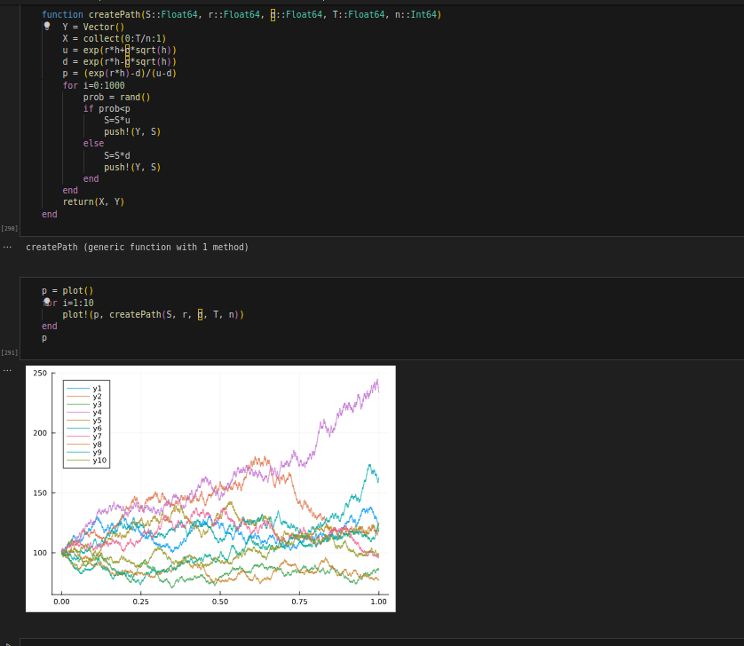{#fig:014 width=50%}

## Выполнение заданий для самостоятельной работы

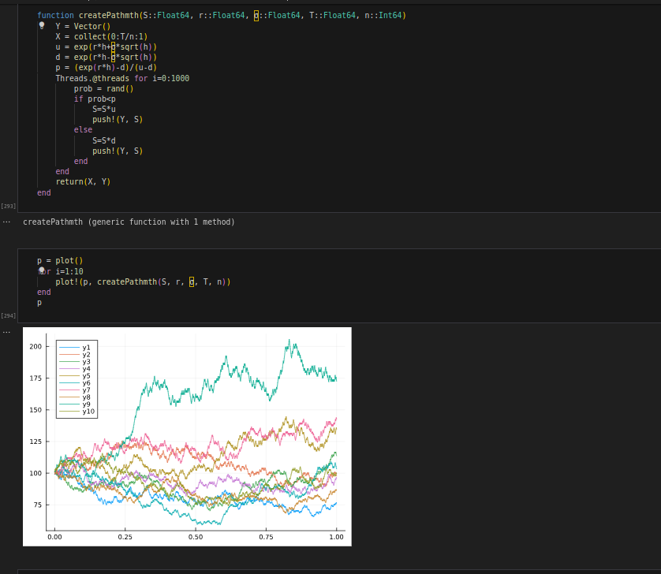{#fig:015 width=50%}

# Выводы

В результате выполнения работы освоили использование специализированных пакетов Julia для обработки данных.

## Список литературы

1. JuliaLang [Электронный ресурс]. 2024 JuliaLang.org contributors. URL: https: //julialang.org/ (дата обращения: 11.10.2024).
2. Julia 1.11 Documentation [Электронный ресурс]. 2024 JuliaLang.org contributors. URL: https://docs.julialang.org/en/v1/ (дата обращения: 11.10.2024).